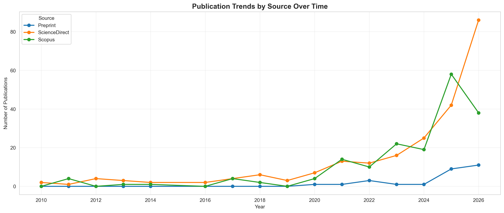
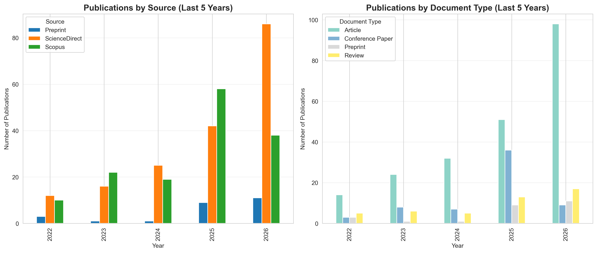
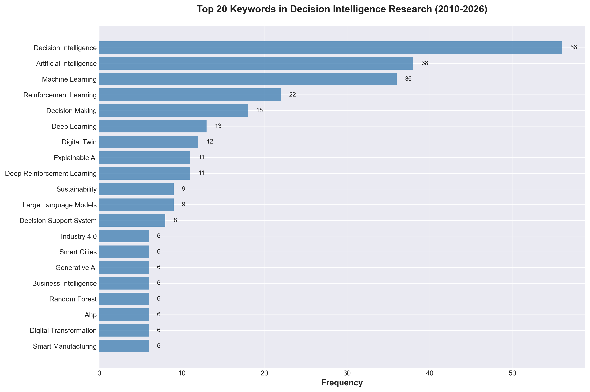
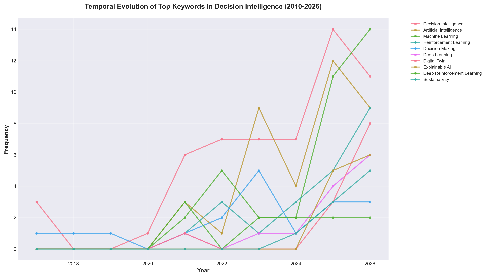
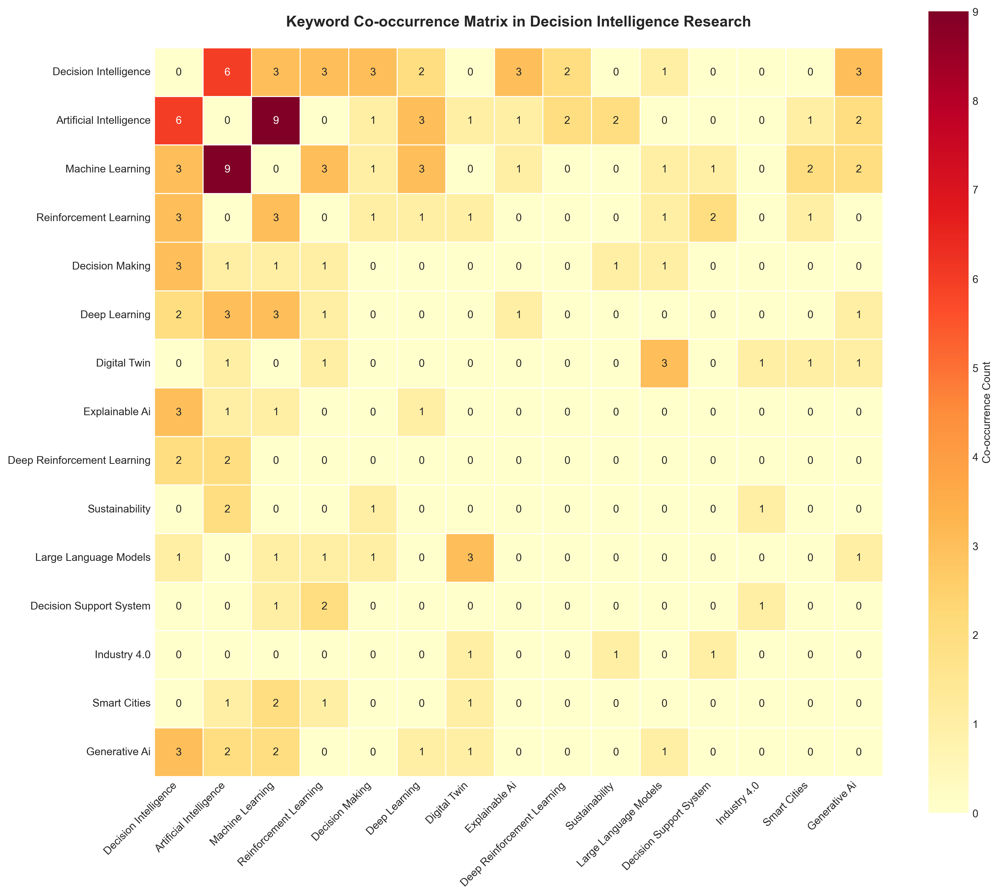
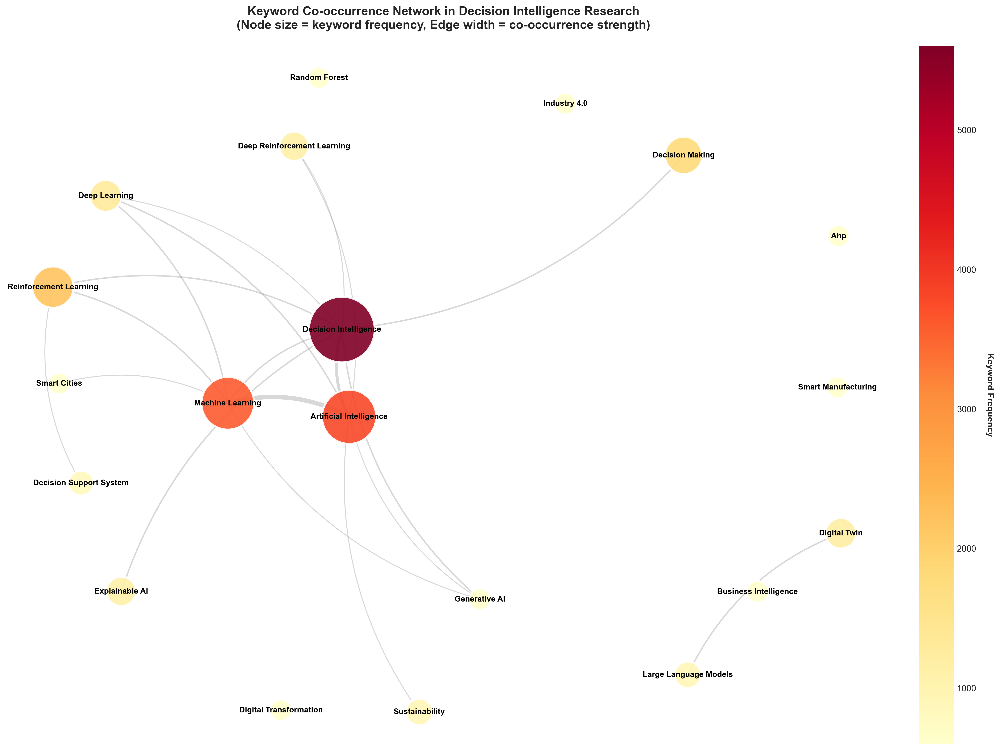

# Decision Intelligence Evolution Analysis

An analytical study tracking the evolution of "Decision Intelligence" as a research topic across academic literature from 2010 to 2026.

## Overview

This analysis examines how the term "Decision Intelligence" has emerged and evolved in scholarly publications by integrating data from three major sources: Scopus, ScienceDirect, and preprint repositories (Arxiv, SSRN, TechRxiv).

### Historical Context

**Dr. Lorien Pratt** first coined and developed the term "Decision Intelligence." By **2010**, she and **Mark Zangari** founded the related concept of "decision engineering," which was officially formalized and renamed as **Decision Intelligence (DI) around 2012**.

This analysis focuses on the period from **2010 onwards**, capturing the emergence and evolution of Decision Intelligence as a formal discipline.

## Built with IBM Bob

This analysis was developed using **IBM Bob**, an AI-powered coding assistant that helps accelerate development and analysis workflows.

**Development Time:** This entire analysis—from initial setup to final visualizations—was completed in approximately **2 hours and 16 minutes** with Bob's assistance.

**Try IBM Bob for free:** [https://bob.ibm.com/trial](https://bob.ibm.com/trial)

## Key Findings

### Temporal Evolution

The analysis reveals the publication trajectory of "Decision Intelligence" research since its formalization:

- **Analysis Period:** 2010-2026 (17 years)
- **Starting Point:** 2010 (when the concept was first developed)
- **Formalization:** ~2012 (official naming as Decision Intelligence)
- **Recent Growth:** Significant acceleration in the last 5 years
- **Peak Year:** [See temporal analysis charts in `output/`]

### Source Distribution

Publications are distributed across three primary sources:

1. **Scopus Database:** Comprehensive multidisciplinary coverage
2. **ScienceDirect:** Elsevier's full-text database
3. **Preprints:** Early-stage research from Arxiv, SSRN, and TechRxiv

**Note:** Scopus and ScienceDirect data were deduplicated using DOI-based matching to avoid double-counting publications indexed in both databases.

### Document Type Analysis

The study focuses on three scholarly publication types:

- **Articles:** Peer-reviewed research papers
- **Reviews:** Comprehensive literature reviews
- **Conference Papers:** Conference proceedings and presentations

**Filtering Strategy:** Scopus and ScienceDirect records were filtered to include only these three types, while all preprints were retained to capture emerging research trends.

### Visualizations

All analytical outputs are available in the `output/` directory:

1. **Temporal Evolution** (`output/temporal-evolution.png`)
   - Publications per year (2010-2026)
   - Cumulative growth curve
   - Year-over-year growth rates


2. **Source Distribution** (`output/source-distribution.png`)
   - Breakdown by database (Scopus/ScienceDirect/Preprints)
   - Overlap analysis between Scopus and ScienceDirect


3. **Temporal Trends by Source** (`output/temporal-trends-by-source.png`)
   - Publication trends over time separated by data source
   - Comparative analysis of Scopus, ScienceDirect, and Preprints



4. **Recent Growth Analysis** (`output/recent-growth-analysis.png`)
   - Detailed analysis of recent publication trends
   - Identification of key growth periods since 2010



### Keyword Analysis and Co-occurrence Mapping

Advanced keyword analysis reveals the conceptual landscape and thematic evolution of Decision Intelligence research:

5. **Top Keywords** (`output/top-keywords.png`)
   - Most frequent keywords across all publications
   - Frequency distribution showing dominant themes
   - Identifies core concepts in Decision Intelligence discourse



6. **Keyword Temporal Trends** (`output/keyword-temporal-trends.png`)
   - Evolution of top keywords over time (2010-2026)
   - Tracks emergence and growth of key concepts
   - Reveals shifting research priorities and focus areas



7. **Keyword Co-occurrence Heatmap** (`output/keyword-cooccurrence-heatmap.png`)
   - Matrix showing relationships between keywords
   - Identifies thematic clusters and research intersections
   - Shows strength of relationships between key terms



8. **Keyword Network Graph** (`output/keyword-network-graph.png`)
   - VOSviewer-style network visualization
   - Node size represents keyword frequency
   - Edge width represents co-occurrence strength
   - Reveals research theme clusters and connections



**Keyword Data Outputs:**
- `top_keywords.csv` - Ranked list of most frequent keywords with counts
- `keyword_trends_by_year.csv` - Temporal evolution data for top keywords
- `keyword_cooccurrence_matrix.csv` - Full co-occurrence matrix
- `top_cooccurring_pairs.csv` - Most frequently co-occurring keyword pairs

**Note:** Keyword analysis uses abstracts and author keywords, which are processed locally and not included in the Git repository.

## Methodology

### Data Collection

**Search Term:** `"Decision Intelligence"` (applied consistently across all sources)

**Sources:**
1. **Scopus:** CSV export with full metadata
2. **ScienceDirect:** Three separate BibTeX exports (articles, reviews, conference papers) to overcome web application export limitations
3. **Preprints:** CSV extracted using LLM assistance due to Scopus preprint export limitations

### Data Processing Pipeline

```
1. Load Data
   ├── Scopus CSV
   ├── ScienceDirect BibTeX (3 files)
   └── Preprints CSV

2. Source Flagging
   └── Tag each record with origin

3. Document Type Mapping
   └── Extract types from ScienceDirect filenames

4. Deduplication (Scopus ↔ ScienceDirect)
   └── DOI-based matching and removal

5. Year Filtering
   └── Keep only 2010+ records (all sources)

6. Document Type Filtering
   ├── Scopus: Keep Article/Review/Conference only
   ├── ScienceDirect: Keep Article/Review/Conference only
   └── Preprints: Keep all

7. Integration
   └── Merge filtered Scopus + ScienceDirect + all Preprints

8. Analysis & Visualization
   └── Temporal trends (2010-2026), distributions, statistics

9. Export
   └── Integrated dataset (CSV, without abstracts for Git compliance)
```

### Deduplication Strategy

**Challenge:** Publications indexed in both Scopus and ScienceDirect create duplicates.

**Solution:** 
- DOI-based matching identifies overlapping records
- Scopus records retained (more complete metadata)
- ScienceDirect duplicates removed
- ScienceDirect document type classification preserved in Scopus records

**Result:** Clean dataset with no double-counting

## Data Limitations and Compliance

### Elsevier Terms of Use

**Important:** Data from Elsevier sources (Scopus and ScienceDirect) **cannot be redistributed** according to their Terms of Use. 

The `data/` directory is excluded from version control. To replicate this analysis:
1. Obtain institutional access to Scopus and ScienceDirect
2. Perform searches using the term "Decision Intelligence"
3. Export data following the methodology described
4. Place files in the `data/` directory

### Known Limitations

1. **Temporal Scope:** Analysis limited to 2010+ (when DI was first developed)
2. **ScienceDirect Export:** Web application limits required splitting exports by document type
3. **Preprint Data:** Manual extraction using LLM due to Scopus export constraints
4. **Coverage:** Limited to publications explicitly using "Decision Intelligence" term
5. **Language:** Primarily English-language publications
6. **Access Date:** Data collected May 2026
7. **Abstracts:** Removed from exported dataset for Git compliance with publisher ToU

## Repository Structure

```
citrus-decision-intelligence/
├── data/                          # Source data (not in git)
│   ├── lexical-DI-scopus_export_*.csv
│   ├── lexical-DI-article-*.bib
│   ├── lexical-DI-review-*.bib
│   ├── lexical-DI-conference-*.bib
│   └── preprints.csv
├── output/                        # Analysis outputs
│   ├── decision_intelligence_integrated.csv  # Final dataset (no abstracts)
│   ├── decision_intelligence_with_abstracts.csv  # With abstracts (not in git)
│   ├── temporal-evolution.png     # Temporal trends visualization
│   ├── source-distribution.png    # Source breakdown visualization
│   ├── temporal-trends-by-source.png  # Source-specific trends
│   ├── recent-growth-analysis.png # Recent growth patterns
│   ├── top-keywords.png           # Top keywords visualization
│   ├── keyword-temporal-trends.png  # Keyword evolution over time
│   ├── keyword-cooccurrence-heatmap.png  # Co-occurrence matrix heatmap
│   ├── keyword-network-graph.png  # Network visualization (VOSviewer-style)
│   ├── top_keywords.csv           # Ranked keyword list
│   ├── keyword_trends_by_year.csv # Temporal keyword data
│   ├── keyword_cooccurrence_matrix.csv  # Co-occurrence matrix
│   └── top_cooccurring_pairs.csv  # Top keyword pairs
├── 01_data_preparation.ipynb      # Data loading & processing (run first)
├── 02_visualization.ipynb         # Temporal analysis & visualizations (run second)
├── 03_keyword_analysis.ipynb      # Keyword trends & co-occurrence (run third)
├── .gitignore
├── LICENSE
├── README.md                      # This file
└── INSTALL.md                     # Replication instructions
```

## Outputs

### Generated Files

1. **`output/decision_intelligence_integrated.csv`**
   - Deduplicated and integrated dataset (2010-2026)
   - All sources combined
   - **Abstracts removed** for Git compliance
   - Ready for further analysis

2. **Temporal Analysis Visualizations** (4 PNG files)
   - `temporal-evolution.png` - Publication trends, cumulative growth, growth rates
   - `source-distribution.png` - Breakdown by database (Scopus/ScienceDirect/Preprints)
   - `temporal-trends-by-source.png` - Publication trends over time separated by data source
   - `recent-growth-analysis.png` - Detailed analysis of recent publication trends and key growth periods

3. **Keyword Analysis Visualizations** (4 PNG files)
   - `top-keywords.png` - Most frequent keywords with frequency distribution
   - `keyword-temporal-trends.png` - Evolution of top keywords over time (2010-2026)
   - `keyword-cooccurrence-heatmap.png` - Co-occurrence matrix showing keyword relationships
   - `keyword-network-graph.png` - VOSviewer-style network visualization of keyword connections

4. **Keyword Analysis Data** (4 CSV files)
   - `top_keywords.csv` - Ranked list of most frequent keywords with counts and percentages
   - `keyword_trends_by_year.csv` - Temporal evolution data for top keywords
   - `keyword_cooccurrence_matrix.csv` - Full co-occurrence matrix for network analysis
   - `top_cooccurring_pairs.csv` - Most frequently co-occurring keyword pairs

5. **Dataset with Abstracts** (Local only, not in Git)
   - `decision_intelligence_with_abstracts.csv` - Full dataset including abstracts for keyword analysis
   - Used by notebook 03 for keyword extraction and co-occurrence mapping
   - **Not committed to Git** due to publisher Terms of Use

### Summary Statistics

Key metrics from the analysis:

- **Total Unique Publications:** [See notebook output]
- **Scopus Records:** [Filtered to Article/Review/Conference]
- **ScienceDirect Records:** [Unique, filtered records]
- **Preprints:** [All preprints included]
- **Duplicates Removed:** [DOI-based deduplication count]
- **Time Span:** 2010-2026 (since DI was first developed)
- **Peak Publication Year:** [Year with most publications]
- **5-Year Growth Rate:** [Recent trend]
- **Data Quality:** Abstracts removed from exported dataset

## Citation

If you use this analysis or methodology, please cite appropriately and ensure compliance with data provider terms of use.

## License

See [LICENSE](LICENSE) file for details.

## Replication

For detailed instructions on replicating this analysis, see [INSTALL.md](INSTALL.md).

## Execution Order

To replicate this analysis:

1. **Run `01_data_preparation.ipynb`** - Loads, deduplicates, filters (2010+), and exports data (with and without abstracts)
2. **Run `02_visualization.ipynb`** - Creates temporal visualizations and analysis
3. **Run `03_keyword_analysis.ipynb`** - Performs keyword extraction, trends analysis, and co-occurrence mapping

**Note:** Notebook 03 requires the file with abstracts generated by notebook 01. This file is for local analysis only and is not committed to Git.

---

**Research Purpose:** This analysis is conducted for academic research to understand the emergence and evolution of "Decision Intelligence" as a scholarly concept since its formalization in 2010.

**Data Compliance:** Users must obtain their own institutional access to Scopus and ScienceDirect and comply with all applicable terms of service. Abstracts are not included in the exported dataset to comply with publisher Terms of Use.

**Historical Attribution:** The term "Decision Intelligence" was coined and developed by Dr. Lorien Pratt, with the formal discipline emerging around 2010-2012.