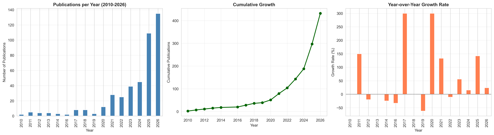
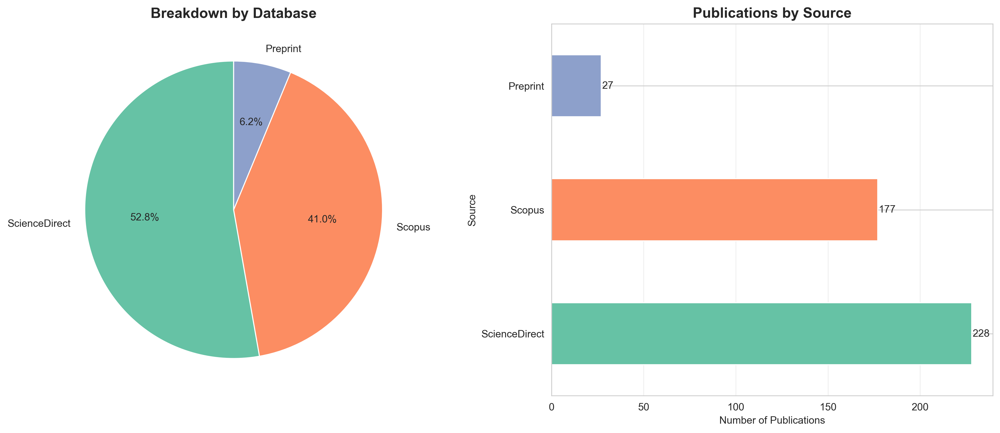

# Decision Intelligence Evolution Analysis

An analytical study tracking the evolution of "Decision Intelligence" as a research topic across academic literature from 2010 to 2026.

## Overview

This analysis examines how the term "Decision Intelligence" has emerged and evolved in scholarly publications by integrating data from three major sources: Scopus, ScienceDirect, and preprint repositories (Arxiv, SSRN, TechRxiv).

### Historical Context

**Dr. Lorien Pratt** first coined and developed the term "Decision Intelligence." By **2010**, she and **Mark Zangari** founded the related concept of "decision engineering," which was officially formalized and renamed as **Decision Intelligence (DI) around 2012**.

This analysis focuses on the period from **2010 onwards**, capturing the emergence and evolution of Decision Intelligence as a formal discipline.

## Key Findings

### Temporal Evolution

The analysis reveals the publication trajectory of "Decision Intelligence" research since its formalization:

- **Analysis Period:** 2010-2026 (17 years)
- **Starting Point:** 2010 (when the concept was first developed)
- **Formalization:** ~2012 (official naming as Decision Intelligence)
- **Recent Growth:** Significant acceleration in the last 5 years
- **Peak Year:** [See temporal analysis charts in `output/`]

### Source Distribution

Publications are distributed across three primary sources:

1. **Scopus Database:** Comprehensive multidisciplinary coverage
2. **ScienceDirect:** Elsevier's full-text database
3. **Preprints:** Early-stage research from Arxiv, SSRN, and TechRxiv

**Note:** Scopus and ScienceDirect data were deduplicated using DOI-based matching to avoid double-counting publications indexed in both databases.

### Document Type Analysis

The study focuses on three scholarly publication types:

- **Articles:** Peer-reviewed research papers
- **Reviews:** Comprehensive literature reviews
- **Conference Papers:** Conference proceedings and presentations

**Filtering Strategy:** Scopus and ScienceDirect records were filtered to include only these three types, while all preprints were retained to capture emerging research trends.

### Visualizations

All analytical outputs are available in the `output/` directory:

1. **Temporal Trends** (`output/temporal-evolution.png`)
   - Publications per year (2010-2026)
   - Cumulative growth curve
   - Year-over-year growth rates



2. **Source Distribution** (`output/source-distribution.png`)
   - Breakdown by database (Scopus/ScienceDirect/Preprints)
   - Overlap analysis between Scopus and ScienceDirect



3. **Document Type Distribution** (`output/document-type-distribution.png`)
   - Article vs. Review vs. Conference Paper proportions
   - Evolution of document types over time


4. **Integrated Analysis** (`output/integrated-analysis.png`)
   - Stacked visualizations showing all sources and types over time
   - Identification of key growth periods since 2010


## Methodology

### Data Collection

**Search Term:** `"Decision Intelligence"` (applied consistently across all sources)

**Sources:**
1. **Scopus:** CSV export with full metadata
2. **ScienceDirect:** Three separate BibTeX exports (articles, reviews, conference papers) to overcome web application export limitations
3. **Preprints:** CSV extracted using LLM assistance due to Scopus preprint export limitations

### Data Processing Pipeline

```
1. Load Data
   ├── Scopus CSV
   ├── ScienceDirect BibTeX (3 files)
   └── Preprints CSV

2. Source Flagging
   └── Tag each record with origin

3. Document Type Mapping
   └── Extract types from ScienceDirect filenames

4. Deduplication (Scopus ↔ ScienceDirect)
   └── DOI-based matching and removal

5. Year Filtering
   └── Keep only 2010+ records (all sources)

6. Document Type Filtering
   ├── Scopus: Keep Article/Review/Conference only
   ├── ScienceDirect: Keep Article/Review/Conference only
   └── Preprints: Keep all

7. Integration
   └── Merge filtered Scopus + ScienceDirect + all Preprints

8. Analysis & Visualization
   └── Temporal trends (2010-2026), distributions, statistics

9. Export
   └── Integrated dataset (CSV, without abstracts for Git compliance)
```

### Deduplication Strategy

**Challenge:** Publications indexed in both Scopus and ScienceDirect create duplicates.

**Solution:** 
- DOI-based matching identifies overlapping records
- Scopus records retained (more complete metadata)
- ScienceDirect duplicates removed
- ScienceDirect document type classification preserved in Scopus records

**Result:** Clean dataset with no double-counting

## Data Limitations and Compliance

### Elsevier Terms of Use

**Important:** Data from Elsevier sources (Scopus and ScienceDirect) **cannot be redistributed** according to their Terms of Use. 

The `data/` directory is excluded from version control. To replicate this analysis:
1. Obtain institutional access to Scopus and ScienceDirect
2. Perform searches using the term "Decision Intelligence"
3. Export data following the methodology described
4. Place files in the `data/` directory

### Known Limitations

1. **Temporal Scope:** Analysis limited to 2010+ (when DI was first developed)
2. **ScienceDirect Export:** Web application limits required splitting exports by document type
3. **Preprint Data:** Manual extraction using LLM due to Scopus export constraints
4. **Coverage:** Limited to publications explicitly using "Decision Intelligence" term
5. **Language:** Primarily English-language publications
6. **Access Date:** Data collected May 2026
7. **Abstracts:** Removed from exported dataset for Git compliance with publisher ToU

## Repository Structure

```
citrus-decision-intelligence/
├── data/                          # Source data (not in git)
│   ├── lexical-DI-scopus_export_*.csv
│   ├── lexical-DI-article-*.bib
│   ├── lexical-DI-review-*.bib
│   ├── lexical-DI-conference-*.bib
│   └── preprints.csv
├── output/                        # Analysis outputs
│   ├── decision_intelligence_integrated.csv  # Final dataset (no abstracts)
│   ├── temporal-evolution.png     # Visualization 1
│   ├── source-distribution.png    # Visualization 2
│   ├── document-type-distribution.png  # Visualization 3
│   └── integrated-analysis.png    # Visualization 4
├── 01_data_preparation.ipynb      # Data loading & processing (run first)
├── 02_visualization.ipynb         # Analysis & visualizations (run second)
├── .gitignore
├── LICENSE
├── README.md                      # This file
└── INSTALL.md                     # Replication instructions
```

## Outputs

### Generated Files

1. **`output/decision_intelligence_integrated.csv`**
   - Deduplicated and integrated dataset (2010-2026)
   - All sources combined
   - **Abstracts removed** for Git compliance
   - Ready for further analysis

2. **Visualization Charts** (4 PNG files in `output/` directory)
   - `temporal-evolution.png` - Publication trends, cumulative growth, growth rates
   - `source-distribution.png` - Breakdown by database (Scopus/ScienceDirect/Preprints)
   - `document-type-distribution.png` - Article/Review/Conference proportions and evolution
   - `integrated-analysis.png` - Stacked visualizations and key growth periods

### Summary Statistics

Key metrics from the analysis:

- **Total Unique Publications:** [See notebook output]
- **Scopus Records:** [Filtered to Article/Review/Conference]
- **ScienceDirect Records:** [Unique, filtered records]
- **Preprints:** [All preprints included]
- **Duplicates Removed:** [DOI-based deduplication count]
- **Time Span:** 2010-2026 (since DI was first developed)
- **Peak Publication Year:** [Year with most publications]
- **5-Year Growth Rate:** [Recent trend]
- **Data Quality:** Abstracts removed from exported dataset

## Citation

If you use this analysis or methodology, please cite appropriately and ensure compliance with data provider terms of use.

## License

See [LICENSE](LICENSE) file for details.

## Replication

For detailed instructions on replicating this analysis, see [INSTALL.md](INSTALL.md).

## Execution Order

To replicate this analysis:

1. **Run `01_data_preparation.ipynb`** - Loads, deduplicates, filters (2010+), and exports data
2. **Run `02_visualization.ipynb`** - Creates visualizations and analysis

---

**Research Purpose:** This analysis is conducted for academic research to understand the emergence and evolution of "Decision Intelligence" as a scholarly concept since its formalization in 2010.

**Data Compliance:** Users must obtain their own institutional access to Scopus and ScienceDirect and comply with all applicable terms of service. Abstracts are not included in the exported dataset to comply with publisher Terms of Use.

**Historical Attribution:** The term "Decision Intelligence" was coined and developed by Dr. Lorien Pratt, with the formal discipline emerging around 2010-2012.